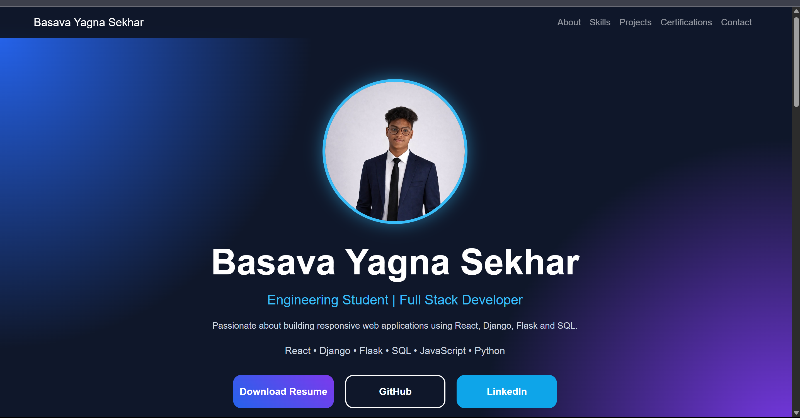
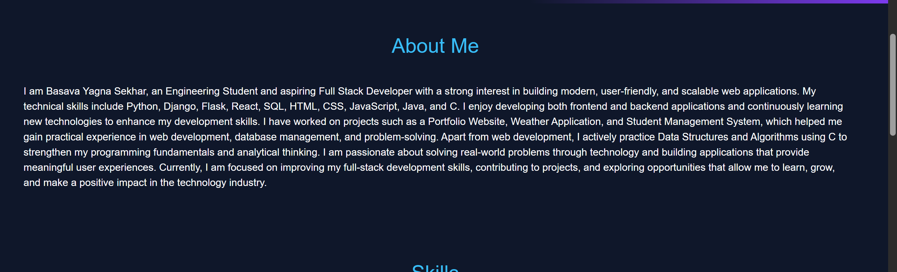
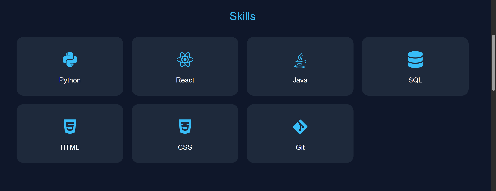
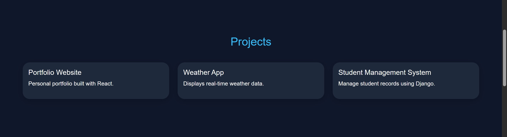
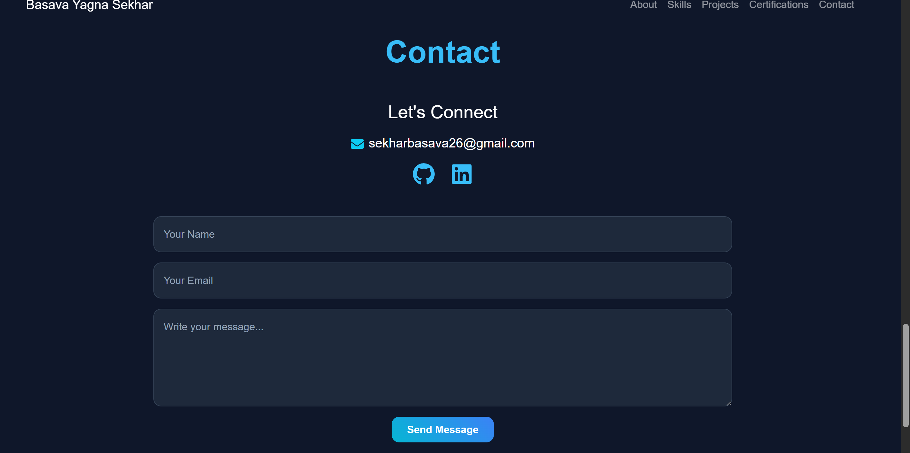

# FUTURE_FS_01 - Full Stack Portfolio Website

## 🌐 Live Demo

**Frontend (Vercel):**
https://future-fs-01-eight-psi.vercel.app/

**Backend (Render):**
https://future-fs-01-ngpb.onrender.com/

---

## 📌 Project Overview

This is a Full Stack Portfolio Website developed using React.js for the frontend and Django REST Framework for the backend.

The website showcases my profile, skills, projects, certifications, and provides a contact form for visitors to send messages. Contact details are stored in the backend database through a REST API.

---

## 🚀 Features

* Responsive Portfolio Website
* Professional Hero Section
* About Me Section
* Skills Showcase
* Projects Showcase
* Certifications Section
* Resume Download Feature
* Contact Form with Backend Integration
* Contact Messages Stored in Database
* Smooth Scrolling Navigation
* Dark Theme UI
* Mobile Responsive Design
* Deployed Frontend and Backend

---

## 🛠️ Tech Stack

### Frontend

* React.js
* Bootstrap
* Axios
* Vite
* AOS (Animate On Scroll)

### Backend

* Django
* Django REST Framework
* SQLite

### Deployment

* Vercel (Frontend)
* Render (Backend)

---

## 📂 Project Structure

FUTURE_FS_01

├── frontend

│ ├── src

│ ├── public

│ └── package.json

│

├── backend

│ ├── contact

│ ├── portfolio

│ ├── manage.py

│ └── requirements.txt

---

## 📸 Portfolio Sections

### Home

Professional introduction and profile section.

### About

Information about education, skills, and career goals.

### Skills

Frontend, Backend, Programming, and Development skills.

### Projects

Showcase of completed projects with descriptions.

### Certifications

Professional certifications and achievements.

### Contact

Visitors can send messages directly through the contact form.

---

## ⚙️ Installation

### Clone Repository

```bash
git clone https://github.com/sekhar2226/FUTURE_FS_01.git
```

### Frontend Setup

```bash
cd frontend
npm install
npm run dev
```

### Backend Setup

```bash
cd backend
python -m venv venv

# Activate Virtual Environment

pip install -r requirements.txt

python manage.py migrate
python manage.py runserver
```

---

## 📧 Contact

**Basava Yagna Sekhar**

GitHub:
https://github.com/sekhar2226

LinkedIn:
https://www.linkedin.com/in/sekhar-basava-206170330/

Email:
[sekharbasava26@gmail.com](mailto:sekharbasava26@gmail.com)

---

## 🎯 Future Enhancements

* Email Notification System
* PostgreSQL Database
* Blog Section
* Project Filtering
* Advanced Animations
* Admin Dashboard Enhancements

---

## 📄 License

This project was developed as part of the Future Interns Full Stack Development Internship Task.
## 📸 Screenshots

### Home Page


### About Section


### Skills Section


### Projects Section


### Certifications Section


### Contact Section

